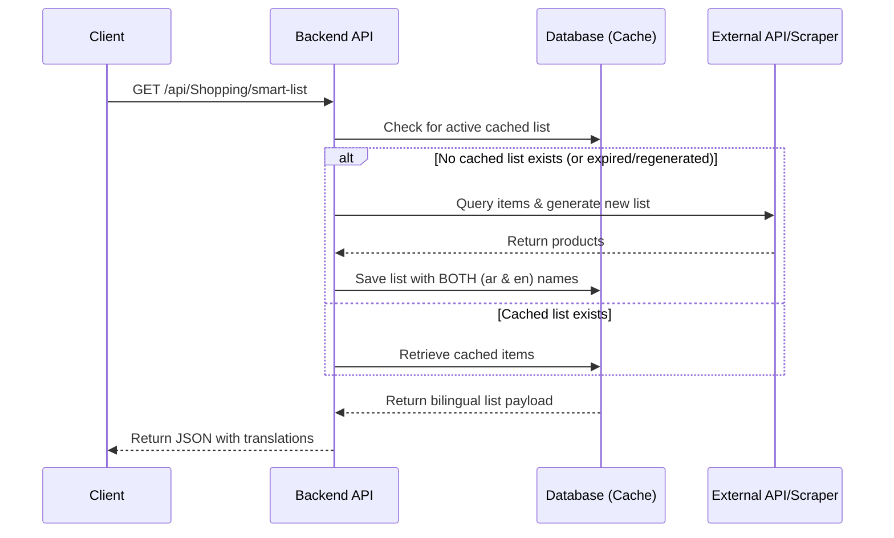

# Backend Integration Guide: Bilingual Shopping List Caching

This document outlines the required backend changes to resolve the language-switching discrepancy in the **Smart Shopping List** feature. 

---

## 1. The Problem Statement

Currently, when the client requests the shopping list via:
* `GET /api/Shopping/smart-list?lang=ar`
* `GET /api/Shopping/smart-list?lang=en`

The backend dynamically executes search queries (e.g. against Carrefour's API or a product index) using language-specific keywords. Because search ranks, item availability, and index entries differ between Arabic and English, **two completely different lists of products are returned**.

### Example Discrepancy:
* **Arabic API Call (`ar`) returns:** "كابوتشينو موكا نسكافيه - 18جم" (Nescafe Mocha Cappuccino) for the "coffee" slot.
* **English API Call (`en`) returns:** "Kufenia Karak Tea - 19 grams" for the "coffee" slot.

As a result, switching the app language changes the actual items, quantities, and totals on the user's shopping list.

---

## 2. The Solution: Persistent Cached List with Bilingual Mapping

To guarantee that the user sees the **exact same items** regardless of language toggling, the backend must transition to a cached database model. 



---

## 3. Recommended Changes

### A. Database Schema Update
Store the generated shopping list in the database for the active user. Each item must support bilingual fields so that translation doesn't require querying external APIs again.

**Proposed `ShoppingListItem` Table schema:**
```sql
CREATE TABLE ShoppingListItems (
    Id INT PRIMARY KEY IDENTITY(1,1),
    UserId NVARCHAR(450) NOT NULL, -- Link to application User
    SlotKey NVARCHAR(100) NOT NULL, -- e.g. "coffee", "rice", "eggs"
    ProductNameAr NVARCHAR(250) NOT NULL,
    ProductNameEn NVARCHAR(250) NOT NULL,
    CategoryAr NVARCHAR(100) NOT NULL,
    CategoryEn NVARCHAR(100) NOT NULL,
    UnitPrice DECIMAL(18,2) NOT NULL,
    Quantity INT NOT NULL,
    TotalPrice DECIMAL(18,2) NOT NULL,
    DiscountPct DECIMAL(5,2) DEFAULT 0,
    IsPriority BIT DEFAULT 0,
    IsCompleted BIT DEFAULT 0,
    CreatedAt DATETIME DEFAULT GETDATE()
);
```

### B. API Response Payload (Bilingual Schema)
Modify the endpoint response model to return both language versions of the product name and category. This allows the frontend to toggle languages instantly without triggering network requests.

**Endpoint:** `GET /api/Shopping/smart-list`

**Response JSON Payload:**
```json
{
  "shopping_list": [
    {
      "slot": "coffee",
      "product_name_ar": "كابوتشينو موكا نسكافيه - 18جم",
      "product_name_en": "Nescafe Mocha Cappuccino - 18g",
      "category_ar": "مشروبات",
      "category_en": "Beverages",
      "unit_price": 12.5,
      "quantity": 2,
      "total_price": 25.0,
      "discount_pct": 0.0,
      "isPriority": false,
      "isCompleted": false
    }
  ],
  "summary": {
    "total_cost": 25.0,
    "items_count": 1
  }
}
```

---

## 4. Execution Workflow on Backend

1. **On `smart-list/generate` (POST):**
   * Clear any existing cached list for the user.
   * Query the products, fetch their English and Arabic titles (either by translating the matches or running a mapped lookup).
   * Save the records into the database with both `ProductNameAr` and `ProductNameEn`.
   * Return the bilingual JSON payload.

2. **On `smart-list` (GET):**
   * Fetch the active items from the `ShoppingListItems` database table.
   * Return them directly in the bilingual schema.
   * **Note:** The `?lang=` query parameter is no longer required for fetching the items since the frontend will have access to both translations.

3. **On `smart-list/modify` (POST):**
   * Update the cached items in the database based on the instructions, ensuring new items are saved with both language names.
